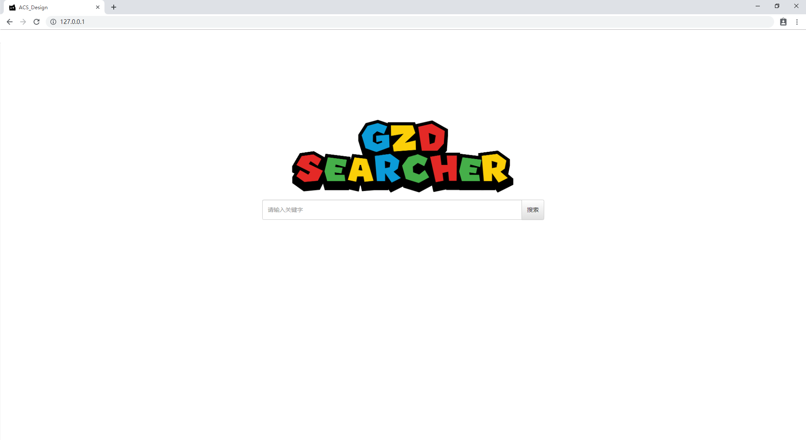
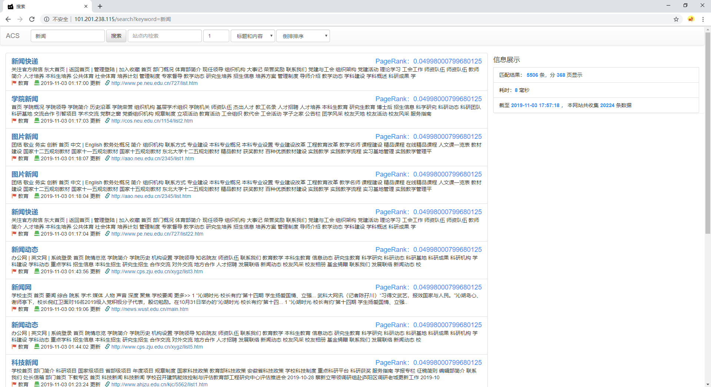

# 小规模搜索引擎Web服务


[主项目](https://github.com/1811455433/ACS_Design)

# 截图

- 主页


- 搜索界面


# ElasticSearch
## 创建索引
```
"analyzer": "ik_max_word"

{
    "settings": {
        "number_of_shards": "5",
        "number_of_replicas": "0"
    },
    "mappings": {
        "properties": {
            "title": {
                "type": "text"
            },
            "weight": {
                "type": "double"
            },
            "content" : {
            	"type" : "text"	
            },
            "content_type": {
                "type": "text"
            },
            "url": {
                "type": "text"
            },
            "update_date": {
                "type": "date",
                "format": "yyyy-MM-dd HH:mm:ss||yyyy-MM-dd||epoch_millis"
            }
        }
    }
}
```

## 查询

- term
```
GET 127.0.0.1/page/_search
{
    "from" : 0,     // 从第一个开始
    "size" : 5,     // 的5个结果
    "query" : {
        "term" : {
            "content" : "西文"
        }
    }
}

GET 127.0.0.1/page/_search
{
    "from" : 0,     // 从第一个开始
    "size" : 5,     // 的5个结果
    "query" : {
        "terms" : {
            "content" : ["西文", "中文"]
        }
    }
}

```

- match（使用分词器）
```
// 查询所有
GET 127.0.0.1/page/_search
{
    "query" : {
        "match_all" : {}
    }
}
```
```
// 短语匹配，严格匹配
GET 127.0.0.1/page/_search
{
    "from" : 0,     // 从第一个开始
    "size" : 5,     // 的5个结果
    "query" : {
        "match_parse" : {
            "content" : "西文"
        }
    }
}
```
```
// 短语匹配，严格匹配
GET 127.0.0.1/page/_search
{
    "from" : 0,     // 从第一个开始
    "size" : 5,     // 的5个结果
    "query" : {
        "match" : {
            "content" : "西文"
        }
    }
}
```